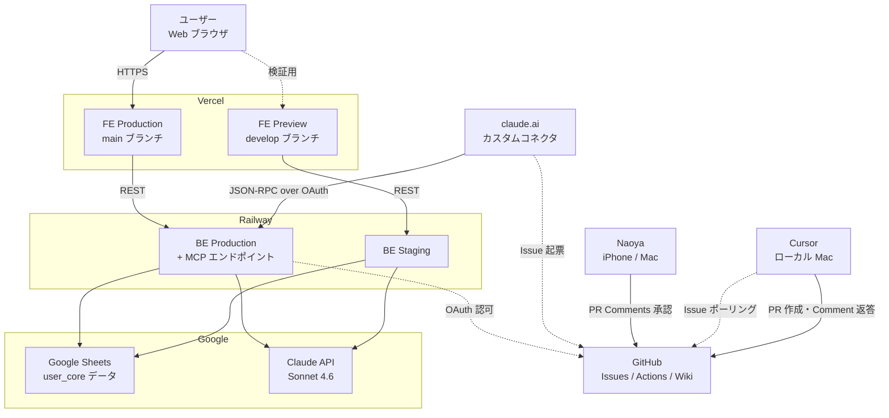
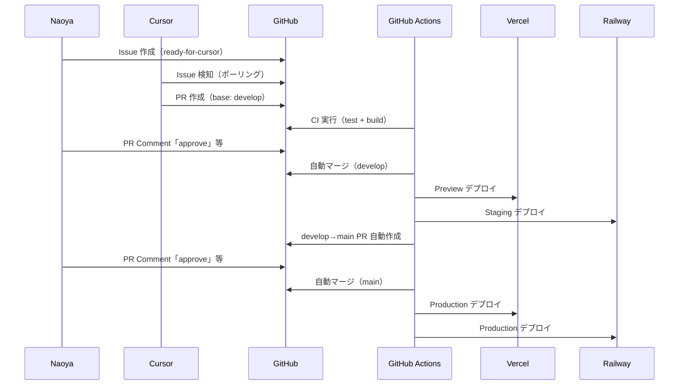

# インフラ構成

**最終更新**: 2026-05-28

thinkgrindai の本番・検証環境のサービス構成・データフロー・ネットワーク経路を一覧する。

---

## 全体構成図

---

## CI/CD フロー図

---

## サービス一覧と責務

| サービス | プラン | 責務 | URL |
|---|---|---|---|
| Vercel | Hobby | FE ホスティング（Production + Preview 自動デプロイ） | Vercel ダッシュボード参照 |
| Railway | Hobby | BE API + MCP エンドポイント・Staging | https://thinkgrindai-production.up.railway.app |
| Google Sheets | 無料 | user_core データ永続化 | シートID は環境変数 |
| Claude API | API 従量 | 問題生成・採点・MCP応答 | https://api.anthropic.com |
| GitHub | Free | Issues・Actions・Wiki | https://github.com/nkhippo/thinkgrindai |
| claude.ai | Pro | 要件議論・MCP経由 Issue 起票 | https://claude.ai |

---

## 環境変数一覧

### Railway BE（本番・Staging 共通）

| 変数名 | 用途 |
|---|---|
| `ANTHROPIC_API_KEY` | Claude API 認証 |
| `GOOGLE_SERVICE_ACCOUNT_EMAIL` | Sheets 認証 |
| `GOOGLE_PRIVATE_KEY` | Sheets 認証 |
| `SPREADSHEET_ID` | データストア |
| `GITHUB_TOKEN` | MCP → GitHub API |
| `GITHUB_OWNER` | リポジトリオーナー名 |
| `GITHUB_REPO` | リポジトリ名 |
| `MCP_API_BASE_URL` | MCP 公開URL（自身の Railway URL） |

### Vercel FE

| 変数名 | 用途 | Production / Preview |
|---|---|---|
| `VITE_API_BASE_URL` | BE エンドポイント | 本番Railway URL / Staging Railway URL |

---

## コスト管理

| サービス | 月額目安（2026-05時点） |
|---|---|
| Vercel Hobby | 無料 |
| Railway Hobby（本番+Staging 2 Service） | $5（Hobby プラン共有） |
| Google Sheets | 無料 |
| Claude API | 従量（利用量に応じて） |
| GitHub Free | 無料 |
| **合計（固定費）** | **約 $5/月** |
